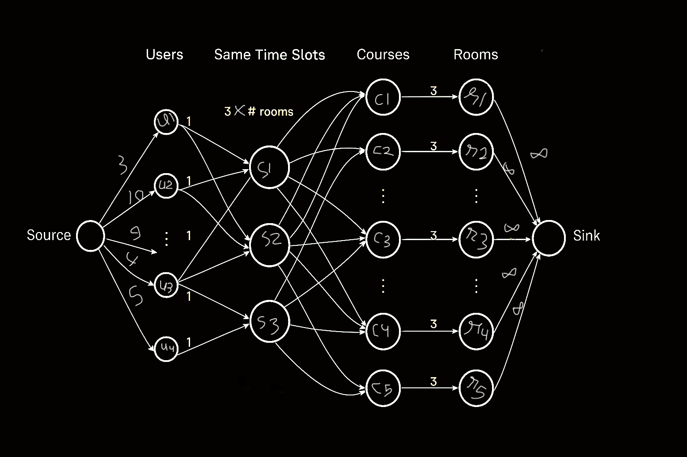

# Exam Management System

This project provides an **automated exam management and observer distribution system**.  
It ensures fair, auditable, and scalable assignment of observers (heads, secretaries, and normal observers) to exam rooms, while respecting user constraints and obligations.

---

## ✨ Features

- **Automatic Observer Distribution**  
  Uses a **Max-Flow algorithm on a bipartite graph** to assign observers fairly across rooms and courses.
- **Obligation Management**  
  Users can mark time slots when they are unavailable to observe. The system respects these constraints during assignment.

- **Role-Based Assignment**  
  The algorithm runs **three times**, once for each role:

  - Head
  - Secretary
  - Normal Observer

- **Room Allocation**  
  Based on the number of students in each course, the system determines the required number of rooms and roles per room.

---

## ⚙️ Core Algorithm

The distribution of observers is modeled as a **Max-Flow problem** with layered bipartite graph construction.

### Graph Layers

**Source → Users → SameTime → Courses → Rooms → Sink**

### Edge Weights

- **Source → Users**: Maximum number of observations the system should assign to a user.
- **Users → SameTime**: Weight = 1 (a user cannot observe multiple places at the same time).
- **SameTime → Courses**: `#roles_per_room × #rooms_needed_for_course_exam`.
- **Courses → Rooms**: `#roles_per_room`.
- **Rooms → Sink**: ∞ (unlimited capacity to sink).

---

## 📷 Graph Illustration

---

## 🚀 Usage

1. Admin sets up the exam program with courses and student counts.
2. The system calculates required rooms.
3. Users mark their unavailable time slots (obligations).
4. Admin clicks **"Distribute Members on Rooms"**.
5. The algorithm runs and produces the final observer distribution.

---

## 🧮 Example

- Course A has 120 students.
- Each room can hold 40 students → 3 rooms needed.
- Each room requires 1 Head, 1 Secretary, and 2 Observers.
- The algorithm assigns available users to these roles across the 3 rooms, respecting their obligations.

---

## 📌 Notes

- The algorithm ensures **fairness** by balancing assignments across users.
- The system is **auditable**: every assignment can be traced back through the Max-Flow solution.
- The modular design allows easy extension for new roles or constraints.

---

## 🛠️ Tech Stack

- **Backend**: PHP/Laravel.
- **Frontend**: Blade.
- **Graph Algorithm**: Max-Flow with bipartite graph modeling.
- **Data Structures**: Multi-partite graph layers.
